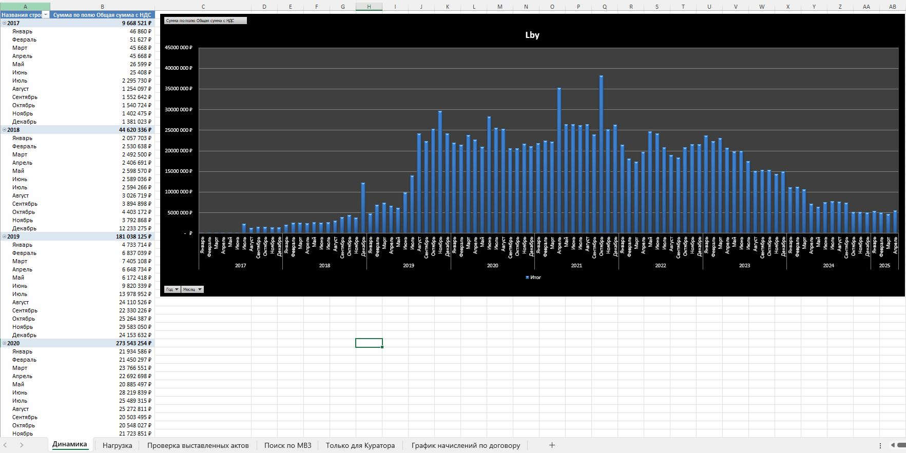
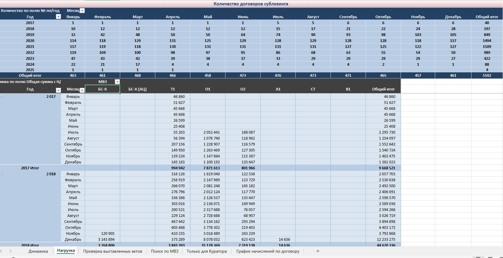

# Кейс №1. Автоматизация проверки лизинговых платежей

**Компания:** ГеоЛад-СТП
**Период:** Март 2018 — Ноябрь 2023
**Роль:** Бизнес-аналитик (внутренний заказчик — директор)

## Проблема (AS-IS)
Проверка ежемесячных актов от лизингодателей и бухгалтерии велась вручную. Директор открывал каждый договор, сверял сумму с графиком платежей и процентной ставкой. Процесс занимал до 3 рабочих дней, был подвержен человеческому фактору и не позволял оперативно выявлять ошибки в выставленных суммах.

## Что сделал
1. **Сбор и анализ требований:** провёл интервью с директором и бухгалтерией, определил ключевые метрики для сверки (сумма по договору, график платежей, НДС, МВЗ, лизинговая компания).
2. **Проектирование решения:** разработал структуру многофункциональной Excel-таблицы, объединившей данные из 5+ источников (реестр договоров, графики лизинга, акты, справочники МВЗ и лизинговых компаний).
3. **Автоматизация расчётов:** реализовал автоматический расчёт расхождений между выставленными актами и графиками платежей, включая проверку НДС и рентабельности.
4. **Создание аналитических срезов:** настроил динамические сводки по месяцам, МВЗ, лизинговым компаниям и годам.
5. **Внедрение и обучение:** обучил директора работе с таблицей (выбор месяца, фильтрация, проверка расхождений).

## Результат (TO-BE)
- **Сокращение времени проверки:** с 3 дней до 2 часов (в 12 раз).
- **Выявление системных ошибок:** автоматический поиск несоответствий в актах бухгалтерии (завышение/занижение сумм, неверный НДС).
- **Прозрачность:** единая база по 130+ активным договорам лизинга (5 000+ накопительно за период, 2017–2025 гг.).
- **Экономический эффект:** предотвращение переплат и штрафов за счёт оперативного выявления ошибок.

## Инструменты
MS Excel (сложные формулы, сводные таблицы, VLOOKUP, SUMIF, логические конструкции), BPMN (описание процесса), анализ данных.

**Артефакт:** [`leasing_payments_anonymized.xlsx`](./leasing_payments_anonymized.xlsx) — данные обезличены и изменены случайным коэффициентом для соблюдения конфиденциальности.

**Визуализация:**

## Контакты

- Telegram: https://t.me/VolkovAY1411
- Email: volkovay1411@yandex.ru

