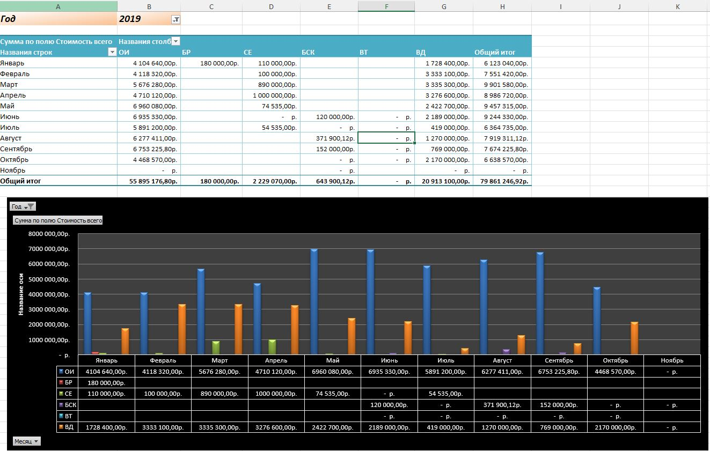
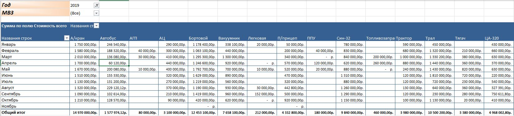
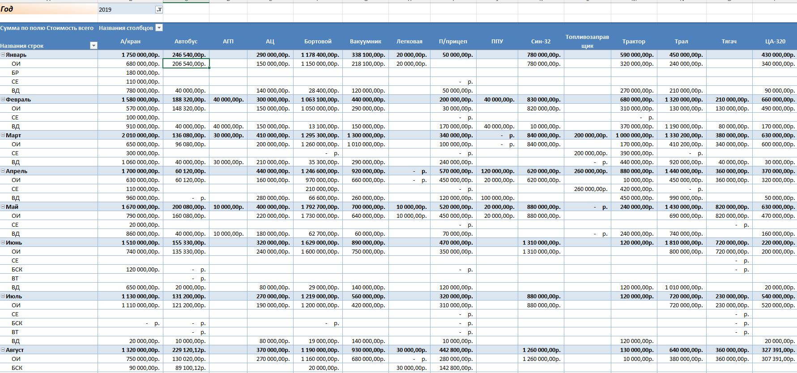

# Кейс №3. Система учёта наёмной техники и анализ затрат по проектам

## Контекст
Транспортная компания привлекала наёмную технику для выполнения проектов в нескольких регионах. Учёт велся в разрозненных таблицах, отсутствовала единая база и аналитика. Требовалось создать систему, которая позволит:
- вести накопительный учёт по каждой единице техники;
- автоматически рассчитывать стоимость услуг;
- строить сводки по МВЗ, подрядчикам, месяцам и категориям;
- анализировать динамику затрат за 2018–2019 гг.

## Что сделал

### 1. Справочник типов ТС (50+ категорий)
Автокраны, автобусы, АГП, АЦ, бортовые, вакуумники, ППУ, Син-32, тралы, тягачи, ЦА-320, ямобуры, топливозаправщики, АПШ, АЗА, баржи, вертолёты, тракторы, компрессоры и др. Автоматическая подстановка категории через VLOOKUP.

### 2. Накопительная база учёта
Поля: месяц, дата, МВЗ, год, тип ТС, принадлежность, госномер, подрядчик, пояснения, цена за 1 ч, цена за 1 км, подписанные часы, пробег, стоимость часов, стоимость пробега, стоимость всего, № УПД (акта). Автоматический расчёт стоимости часов, пробега и итоговой стоимости.

### 3. Сводные таблицы
- Сводная 2019: сумма по подрядчикам с разбивкой по месяцам.
- Динамика 2019: сумма по МВЗ с разбивкой по месяцам.
- Общая сводная: сумма по категориям техники за 2018 год.
- Общая динамика: сумма по МВЗ за 2018–2019 гг.
- Сводная по категориям для МВЗ «БС» за 2019 год.
- Сводная 2018: сумма по подрядчикам за 2018 год.
- Динамика 2018: сумма по МВЗ за 2018 год.

### 4. Анализ аномалий и корректировок
- Выявлены случаи задвоения часов.
- Зафиксированы случаи удержания часов в следующем месяце.
- Обнаружены работы без путевых листов.
- Зафиксированы простои и ремонты.

## Метрики
| Показатель | Значение |
|---|---|
| Категорий техники | 50+ |
| МВЗ | 6 |
| Подрядчиков | 60+ |
| Период анализа | 2018–2019 |
| Сводных таблиц | 7 |
| Выявлено аномалий | 10+ |

## Инструменты
MS Excel (сложные формулы, VLOOKUP, сводные таблицы, накопительная база, анализ динамики), управленческая отчётность.

## Артефакт
[rented_equipment_anonymized.xlsx](rented_equipment_anonymized.xlsx) — данные обезличены: подрядчики заменены на «Подрядчик N», госномера удалены, суммы умножены на случайный коэффициент.

## Визуализация

## Про NDA
Проекты конфиденциальны. Реальные формы, цифры и данные заказчиков не публикую. Подход и логику готов разобрать на собеседовании.
