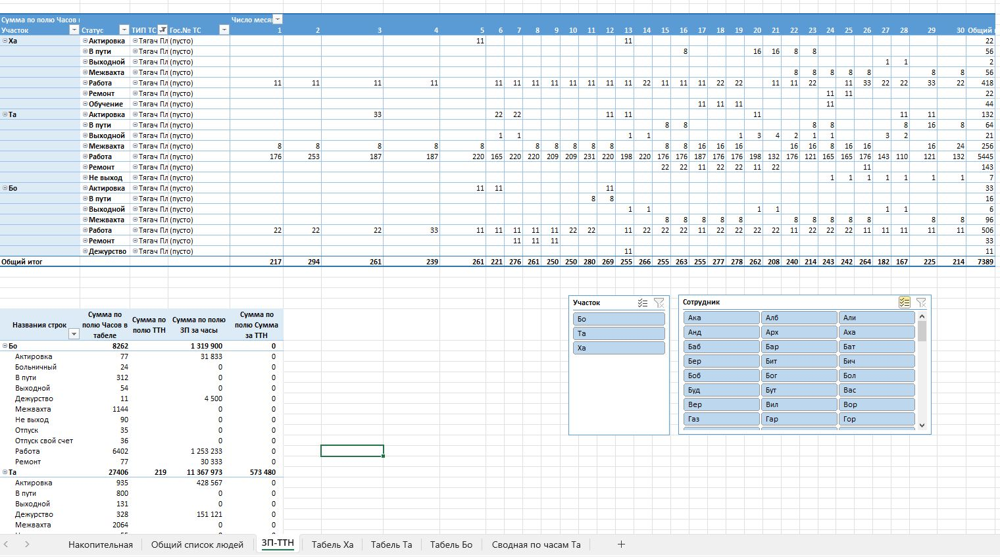
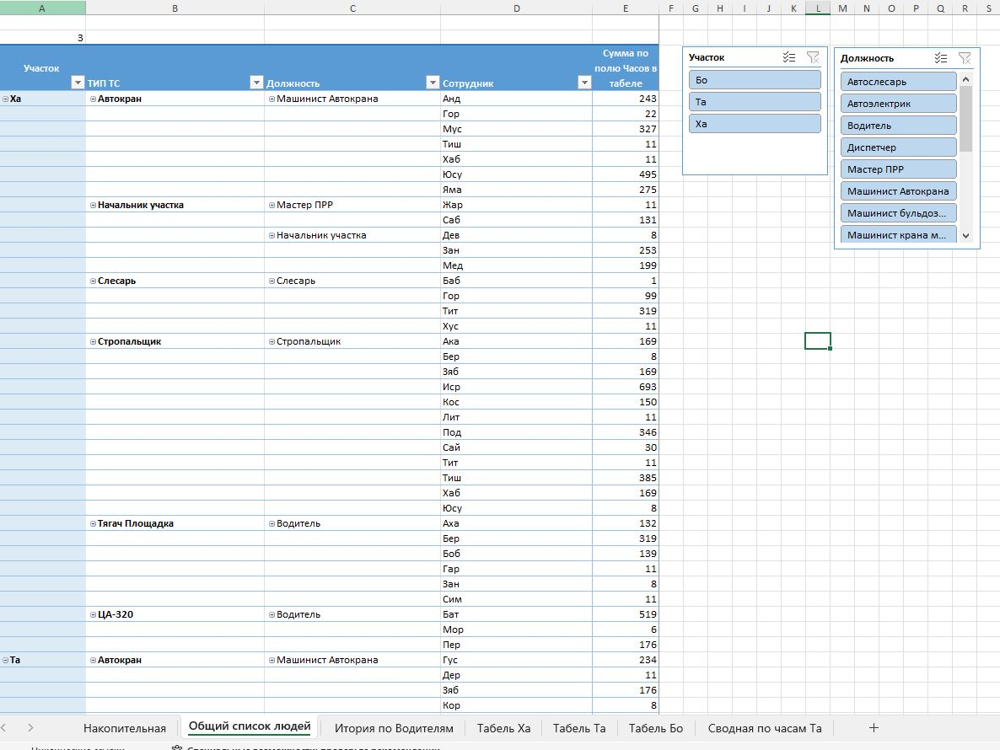

# Кейс №4. Excel-инструмент учёта рабочего времени и расчёта ЗП по договору перевозки оборудования по зимнику

## Контекст
Компания заключила новый договор на перевозку оборудования по зимнику. У ОТиЗа существовала своя форма начисления ЗП, но под новый договор формы не было — тарификация не была определена. Требовалось создать инструмент, который не просто учитывал бы рабочие часы сотрудников, но и сопоставлял их с реализацией заказчику.

## Проблема (AS-IS)
- У ОТиЗа не было формы и понимания, как тарифицировать новый договор.
- Ключевая сложность: одна перевозка могла длиться 22, 44 или даже 88 часов, а ТТН была всего одна. По путевым листам ОТиЗ физически не мог сопоставить рабочие часы с количеством перевозок.
- Расчёт ЗП занимал более 10 дней — пока не соберутся все путевые листы.
- Доплата за ТТН и КТУ не были систематизированы.
- Заказчиков в охвате — 5.

## Моя роль
Бизнес-аналитик / разработчик решения. Внутренний заказчик — ОТиЗ и руководство.

## Что сделал

### 1. Накопительная база учёта
Поля: месяц, дата, ФИО, должность, участок, тип ТС, госномер, статус, заказчик, часы в табеле, ТТН, часы на заказчика в работе, часы на заказчика дежурство, итого часов, разница часов, подтверждающий документ, ставка руб., ставка за ТТН, КТУ, ЗП за часы, сумма за ТТН, комментарий.

### 2. Справочник статусов
Актировка, Больничный, В пути, Выходной, Дежурство, Межвахта, Не выход, Обучение, Отпуск, Отпуск свой счет, Работа, Ремонт.

### 3. Справочник заказчиков
5 заказчиков (обезличены).

### 4. Автоматические расчёты
- итого часов на заказчика = часы в работе + часы дежурства;
- разница часов = итого часов на заказчика − часы в табеле (с исключением для отдельных заказчиков);
- ЗП за часы = (ставка / 330 × часы в табеле) × КТУ, только для статусов «Работа», «Ремонт», «Актировка», «Дежурство»;
- сумма за ТТН = ставка за ТТН × ТТН, если ТТН > 0. Ставка за ТТН варьировалась в зависимости от веса груза и расстояния.

### 5. Сопоставление рабочих часов с количеством перевозок
То, что ОТиЗ не мог сделать по путевым листам.

## Результат (TO-BE)
- Единый инструмент, охвативший 5 заказчиков.
- Расчёт ЗП: срок сокращён с более чем 10 дней (ожидание сбора путевых листов + ручной расчёт) до не более 3 дней (данные → расчёт → согласование → передача в ОТиЗ).
- В ОТиЗ поступает готовая, согласованная с директором информация.
- Прозрачность сопоставления рабочих часов с реализацией заказчику.
- Доплата за ТТН и КТУ систематизированы. КТУ выставлял руководитель подразделения и согласовывал с директором.
- Специалист по табелированию обучен работе с таблицей.

## Метрики
| Показатель | Значение |
|---|---|
| Заказчиков | 5 |
| Статусов | 12 |
| Срок расчёта ЗП | с более чем 10 дней до не более 3 дней |
| Участков | 3 |
| Сотрудников | 50+ |
| Вкладок в инструменте | 7 |

## Инструменты
MS Excel (сложные формулы, VLOOKUP, SUMIF, IF, сводные таблицы, накопительная база, справочники, анализ данных).

## Артефакт
[timesheets_anonymized.xlsx](timesheets_anonymized.xlsx) — данные обезличены: ФИО усечены до трёх букв, участки заменены на «Участок 1–3», заказчики обезличены, суммы изменены случайным коэффициентом.

## Визуализация

## Про NDA
Проекты конфиденциальны. Реальные формы, цифры и данные заказчиков не публикую. Подход и логику готов разобрать на собеседовании.
